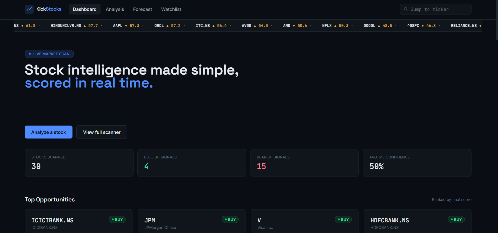
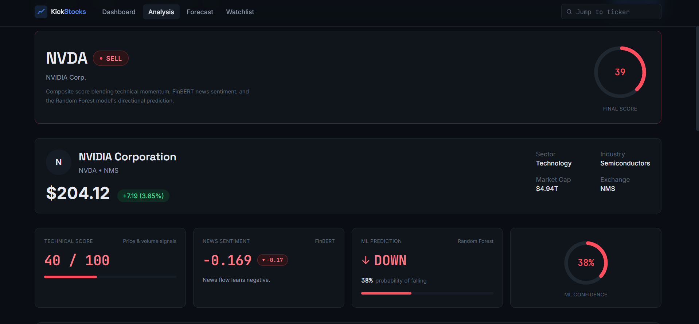
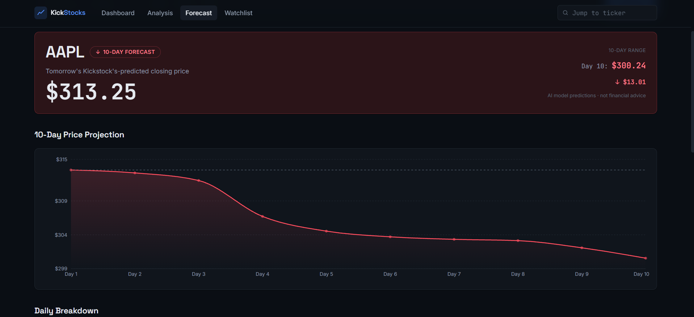
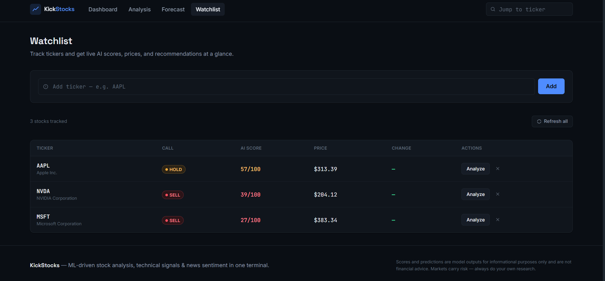

# 📈 KickStocks

> AI-powered stock analysis platform built with Machine Learning, Technical Analysis, News Sentiment, and a modern React dashboard.


---

## 🚀 Overview

KickStocks is an AI-powered stock analysis platform that combines:

- 📊 Technical Indicators
- 📰 News Sentiment Analysis
- 🤖 Machine Learning
- 📈 10-Day Price Forecasting

to generate intelligent Buy / Hold / Sell recommendations.

Unlike traditional stock dashboards, KickStocks uses multiple AI agents that collaborate before producing the final recommendation.

---

# ✨ Features

## 📊 Technical Analysis

- RSI
- SMA20
- SMA50
- Trend Detection
- Technical Score

---

## 📰 News Sentiment

- Live Financial News
- AI Sentiment Analysis
- Bullish / Neutral / Bearish detection

---

## 🤖 Machine Learning

- Random Forest Classifier
- Buy / Hold / Sell Prediction
- Probability Score

---

## 📈 AI Forecast

- Recursive 10-Day Closing Price Forecast
- Historical Trend Learning

---

## 📉 Historical Charts

- Interactive Price Charts
- Multiple Timeframes

---

## 🔥 Stock Scanner

Ranks multiple stocks using

- Technical Score
- News Sentiment
- ML Probability
- Final AI Score

---

## ⭐ Watchlist

- Save favorite stocks
- Quick access

---
# 📸 Screenshots

## Dashboard



---

## Stock Analysis



---

## Forecast



---

## Watchlist



# 🏗 Architecture

```
React Dashboard
        │
        ▼
 FastAPI Backend
        │
 ┌──────┼────────┐
 │      │        │
 ▼      ▼        ▼
Technical  News  ML
 Agent    Agent Agent
 │         │      │
 └──────┬──┴──────┘
        ▼
 Decision Agent
        │
        ▼
 BUY / HOLD / SELL
```

---

# 🛠 Tech Stack

### Frontend

- React
- Vite
- TailwindCSS
- Axios
- Framer Motion
- Recharts

### Backend

- FastAPI
- Python

### Machine Learning

- Scikit-Learn
- Random Forest
- Pandas
- NumPy

### Finance

- yfinance
- ta

### AI / NLP

- Transformers
- FinBERT

---

# 📂 Project Structure

```
KickStocks/
│
├── agents/
├── backend/
├── kickstocks-frontend/
├── models/
├── data/
│
├── requirements.txt
└── README.md
```
Branching Strategy

The KickStocks project follows the GitHub Flow branching strategy, which provides a simple and organized approach to software development. This workflow allows new features to be developed independently while keeping the main project stable.

The main branch contains the stable and tested version of the application. New features and improvements are developed in separate feature branches, allowing changes to be implemented and tested without affecting the main codebase. For this project, a dedicated branch named feature/docker-setup was created to implement Docker containerization.

The development process followed is:

Create a feature branch from the main branch.
Develop and test the new functionality.
Commit changes with meaningful commit messages.
Push the feature branch to GitHub.
Merge the completed feature branch into the main branch after verification.

This branching strategy offers several benefits, including better code organization, easier debugging, safer feature development, and a clear version history. It also supports collaborative development by allowing multiple features to be worked on simultaneously without disrupting the stable version of the project.

Branch Name	Purpose
main	Contains the stable and production-ready version of the application.
feature/docker-setup	Used for developing Docker support before merging into the main branch.
---

# 🚀 Future Improvements

- Portfolio Tracker
- Candlestick Charts
- Real-time WebSocket Prices
- LSTM Forecasting
- AI Chat Assistant
- Email Alerts
- Backtesting Engine

---

# 👨‍💻 Author

**Saumik Laddha**

Built as a Machine Learning + Full Stack portfolio project.
